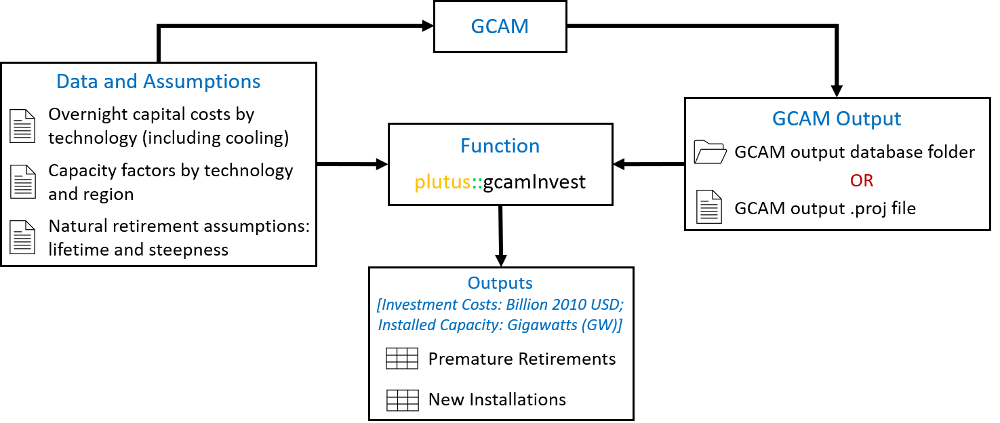

# Summary
`plutus` is an R package that post-processes outputs from the Global Change Analysis Model [GCAM; @Calvin:2019] to calculate the power sector capital investment costs and stranded asset costs associated with GCAM projections of electricity generation by technology. GCAM is a market equilibrium model used to examine the dynamics of the coupled human-Earth system and the response of this system to global change, including socioeconomics, technology, climate, and policy. GCAM tracks electricity generation by technology and vintage over 32 geopolitical regions throughout the lifetime of each generating technology. `plutus` extends GCAM functionality by (1) estimating the foregone economic value of prematurely retired power plants as a result of economic-induced retirements compared to scheduled lifetimes; and (2) estimating the new installations and capital investments driven by future changes in economic, energy, agriculture, and land-use systems in GCAM. The concept and methodology for calculating electricity investments and stranded assets is detailed in @Binsted:2020 and @Iyer:2017.

# Statement of need
The development of `plutus` was encouraged by the importance of assessing the economic implications for the power sector under the long-term trend of energy system transitions from carbon-intensive fuels to low carbon technologies[@Feijoo:2018].  @Khan:2021 recently assessed the impacts of long-term temperature change and variability on electricity investments. @Turner:2017 assessed climate impacts on hydropower and the consequences for global electricity supply investment needs. @Binsted:2020 and @SantosdaSilva:2021 assessed stranded assets and power sector investments in the context of climate mitigation and impacts in Latin America and the Caribbean. Similarly, @McCollum:2018 investigated the necessary energy investments to reach international climate goals by comparing output from GCAM and six other modeling frameworks.  Currently, there exists no uniform procedure amongst the GCAM community for calculating energy investments inclusive of all technologies present in GCAM v5.3. `plutus` addresses this need while providing users with a flexible data structure that can be integrated into workflows that involve a growing suite of GCAM-oriented R packages, such as `metis` [@Khan:2020], to facilitate the analysis and visualization of GCAM output in the energy sector. A tool with easy access to GCAM output and a validated methodology for calculating electricity investments and stranded asset costs will streamline these analyses and enhance GCAM functionality.

# Design and implementation
Numerous data sets and assumptions affect GCAM's power sector energy projections. However, `plutus` only requires that users provide the subset of these assumptions that are directly relevant to calculating new power sector installations and premature retirements by scenario, region, model time period, and technology. Calculating new installed capacity and cost requires assumptions for capital (i.e., overnight) costs ($/KW) and capacity factor. Additionally, calculating stranded assets requires information regarding the planned lifetime for electricity-generating technologies, as well as when they actually retire in GCAM. The `plutus` package is designed for the GCAM global version v5.3 and later.

## Workflow
The required input from users is a GCAM output XML database or an [rgcam generated](https://github.com/JGCRI/rgcam) project file. Users may specify the data for capital cost and capacity factor and assumptions on the planned lifetime associated with their GCAM runs (\autoref{fig:1}). Otherwise, `plutus` will use default data and assumptions from GCAM v5.3 to calculate stranded assets and electricity investments. A detailed, step-by-step tutorial for how to use `plutus` can be accessed here: [Tutorial](https://jgcri.github.io/plutus/articles/CaseTutorial.html). 

## Key functions
`plutus::elecInvest` calculates stranded assets and new installations in terms of investment cost (billion 2010 USD) and installed capacity (GW) by scenario, region, model time period, and technology. The function considers both the electricity generation technology and its associated cooling technology in the overnight capital cost. The function adjusts the retirement for the base/calibration year vintage by mimicking the 'S Curve Shutdown' function used in GCAM (shown below) to represent natural retirements for power plants built in and before the final calibration year (i.e., 2015 for GCAM v5.3). More details on the S-curve function are available in the [GCAM online documentation](https://jgcri.github.io/gcam-doc/en_technologies.html), as well as in @Binsted:2020.

$$ S \: Curve \: Fraction =  \frac{1}{1+ e^{steepness \times (t-halflife)} } $$

`plutus::hydroInvest` updates the `plutus::elecInvest` output with capital investment costs in the hydropower sector. In GCAM v5.3, hydropower generation is exogenously specified and does not compete with other technologies for market share based on economics. To assess investment needs, this function uses an assumed capacity factor and generation cost (both specified in the `assumptions.R` file) to back-calculate implied hydropower investment costs. Stranded assets are not calculated for hydropower, given hydropower cannot retire early in GCAM.

`plutus::gcamInvest` is the integrated function that reads GCAM output, executes the `plutus::elecInvest` and `plutus::hydroInvest` functions, and generates output in a data frame structure that can be used by [`metis`](https://github.com/JGCRI/metis). This function was designed to connect with GCAM and other tools for post-processing and visualization. `plutus::gcamInvest` provides flexibility to users with features such as:

- Access to different GCAM output formats. GCAM output accessed from an `rgcam` project files or directly from an XML database. `plutus::gcamInvest` is able to extract GCAM data from both types of databases by integrating functions from the R package `rgcam`.
- Use default or user-provided input data. The function will take the capital cost, capacity factor data and assumptions of steepness and financial lifetime if provided by the user following the format of each data file, otherwise it will use the default dataset collected from GCAM v5.3. The data and assumptions will be applied to all loaded scenarios from GCAM output.
- Filter GCAM data by scenario and region, and rename scenario names.
- Quick start with example dataset. Users can use an example GCAM database by calling `plutus::exampleGCAMproj` to get started.
- Reload data faster. It can take some time to connect and read data from the GCAM database in the form of an XML database. The function creates a `.proj` file after the data has been extracted from the GCAM database. Reloading the same data using the `.proj` file will reduce processing time.

## Implementation
For demonstration purposes, we used `plutus` to post-process outputs from GCAM v5.3 for a standard reference scenario to estimate power sector stranded assets and new capital investments in the U.S. (\autoref{fig:2}). To produce \autoref{fig:2}, we used `metis` to process and visualize the `plutus` outputs. This interaction with `metis` is facilitated by the standard organization of `plutus` outputs in the required `metis` input format.

# Acknowledgement
Matthew Binsted, Zarrar Khan, Gokul Iyer, Chris R. Vernon, Pralit Patel, and Katherine V. Calvin were supported by the U.S. Department of Energy, Office of Science. This research was part of the research in MultiSector Dynamics, Earth and Environmental System Modeling Program. The Pacific Northwest National Laboratory is operated for DOE by Battelle Memorial Institute under contract DE-AC05-76RL01830. Additionally, Mengqi Zhao, Thomas Wild, Brinda Yarlagadda, and Silvia R. Santos da Silva were supported by the U.S. National Science Foundation under Grant No. 1855982. The views and opinions expressed in this paper are those of the authors alone.

# References
