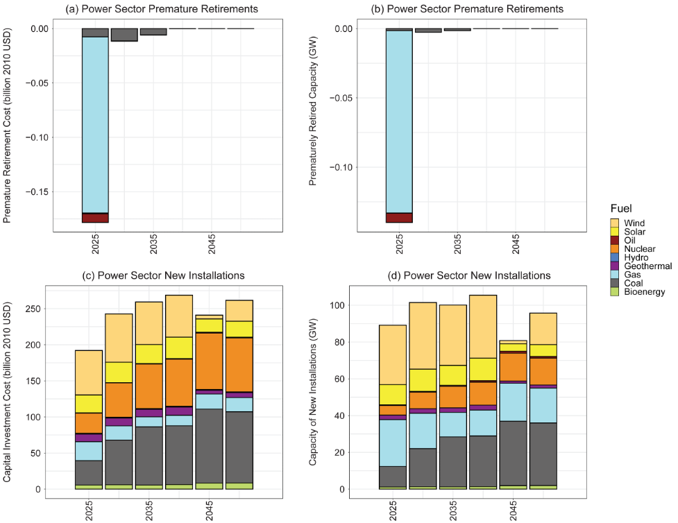

# Summary

`plutus` post-processes outputs from the Global Change Analysis Model (GCAM) [@Calvin:2019] to calculate the electricity investment costs and stranded asset costs associated with GCAM projections of future power sector energy generation by technology. GCAM is an integrated tool for exploring the dynamics of the coupled human-Earth system and the response of this system to global change, such as socioeconomic change, technological change, and policy change. GCAM tracks electricity generation by technology and vintage over 32 geopolitical regions throughout the lifetime of each technology. `plutus` extends GCAM functionality by (1) estimating the forgone economic value of prematurely retired power plants as a result of natural and profit-induced retirement; and (2) estimating the new installations and capital investements driven by interactions among economic, energy, agriculture, and landuse systems in GCAM. The concept and methodology for calculating electricity investments and stranded assets is detailed in [@Binsted:2020].

# Statement of need

The development of `plutus` was encouraged by the increasing interest in stranded assets and electricity investments from a wide range of GCAM users and applications. The long-term trend of energy system transations from carbon-intensive fuels to renewable energy [@Feijoo:2020] requires evaluations on economic implications in the power sector.  @Khan:2021 recently assessed the impacts of long-term temperature change and variability on electricity investments. @Turner:2017 assessed climate impacts on hydropower and the consequences for global electricity supply investment needs. @Binsted:2020 and @SantosdaSilva:2021 assessed stranded assets and power sector investments in the context of climate mitigation in Latin America and the Caribbean. Similarly, @McCollum:2018 investigated the necessary energy investments to reach international policy goals by comparing output from GCAM and six other modeling frameworks.  Currently, there exists no uniform procedure amongst the GCAM community for calculating energy investments inclusive of all technologies present in GCAM 5.3. `plutus` addresses this need while providing users with a flexible data structure that can be integrated into workflows that involve a growing suite of GCAM-oriented R packages, such as `Metis` [@Khan:2020], to augment the analysis and visualization of GCAM output in the energy sector. A tool with easy access to GCAM output and a validated methodology for calculating electricity investments and stranded asset costs will streamline these analyses and enhance GCAM functionality.

# Design and implementation

Numerous data sets and assumptions affect GCAM's power sector energy projections. However, `plutus` only requires that users provide the subet of these assumptions that are directly relevant to calculating new power sector installations and premature retirements by scenario, region, model time period, and technology. Calculating new installation installed capacity and cost requires assumptions for capital (i.e., overnight) costs ($/KWh) and capacity factor. Additionally, calculating stranded assets requires information regarding financial lifetime for electricity-generating technologies. The `plutus` package is designed for GCAM version 5.3 and up. It does not yet work with GCAM-USA.

## Workflow

The mandatory input from users is GCAM output in the format of a GCAM databse folder or an rgcam-based (https://github.com/JGCRI/rgcam) .proj file. Users may specify the input data and assumptions associated with their GCAM runs (Figure 1). Otherwise, `plutus` will use default data and assumptions for GCAM v5.3 to calculate stranded assets and electricity investments. Detailed, step-by-step instructions for how to use `plutus` can be accessed via the repository at https://github.com/JGCRI/plutus. 

## Key functions

`plutus::elecInvest` calculates stranded assets and new installations in terms of investment cost (billion 2010 USD) and installed capacity (GW) by scenario, region, model time period, and technology. The function considers both the electricity generation technology and its associated cooling technology in the overnight capital cost. The function adjusts the retirement for the base/calibration year vintage using the 'S Curve Fraction' function (shown below) to represent natural retirements for power plants built before the model base year (i.e., 2015 for GCAM v5.3). More details on S-curve function are available in the GCAM online documentation (https://jgcri.github.io/gcam-doc/en_technologies.html), as well as in @Binsted:2020.

$$ S \: Curve \: Fraction =  \frac{1}{1+ e^{steepness \times (t-halflife)} } $$

`plutus::hydroInvest` updates the `plutus::elecInvest` output with capital investment costs in the hydropower sector. In GCAM v5.3, hydropower does not endogenously compete with other technologies for market share. Instead, users exogenously specify hydropower production as an input to GCAM. To assess investment needs, this function uses an assumed capacity factor and generation cost (both specified in the assumptions.R file) to back-calculate implied hydropower investment costs. Stranded assets are not calculated for hydropower, given hydropower cannot be retired early in GCAM.

`plutus::gcamInvest` is the integrated function that reads CGAM output, excutes the `plutus::elecInvest` and `plutus::hydroInvest` functions, and generates output in a data frame structure that can be used by `Metis` [@Khan:2020]. This function is developed to connect with GCAM and other tools for post-processesing and visualization. `plutus::gcamInvest` provides flexibility to users with features such as:

- Access to different GCAM output database formats. GCAM output databases can be in formats such as ".proj" files or a folder of ".basex" files. `plutus::gcamInvest` is able to extract GCAM data from both types of databases by integrating functions from the R package "rgcam".
- Use default or user-provided input data. The function will take the capital cost, capacity factor data and assumptions of steepness and financial lifetime if provided by the user following the format of each data file, otherwise it will use the default dataset collected from GCAM 5.3.
- Filter GCAM data by scenario and region. Users can optionally select scenarios and regions of interest.
- Quick start with example dataset. Users can use an example GCAM database by calling `plutus::exampleGCAMporj` to get started. 
- Rename scenarios.
- Reload data faster. It can take some time to connect and read data from the GCAM database in the form of '.basex' database. The funtion creates a ".proj" file after the data has been extracted from the GCAM database. Reloading the same data using the ".proj" file will reduce processing time.

## Implementation

For demonstration purposes, we used `plutus` to post-process outputs from GCAM v5.3 for a standard Reference scenario to estimate power sector stranded assets and new capital investments in the U.S. (Figure 2). To produce Figure 2, we used `Metis` [@Khan:2020] to process and visualize the `plutus` outputs. This interaction with `Metis` is facilitated by the standard organization of `plutus` outputs in the requried `Metis` input format.

# Acknowledgement

This research was supported by the U.S. Department of Energy, Office of Science, as part of research in MultiSector Dynamics, Earth and Environmental System Modeling Program. Additionally, this material is based upon work supported by the U.S. National Science Foundation under Grant No. 1855982. 

# References
