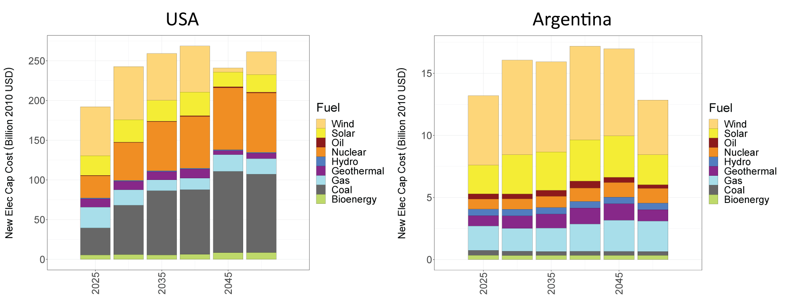
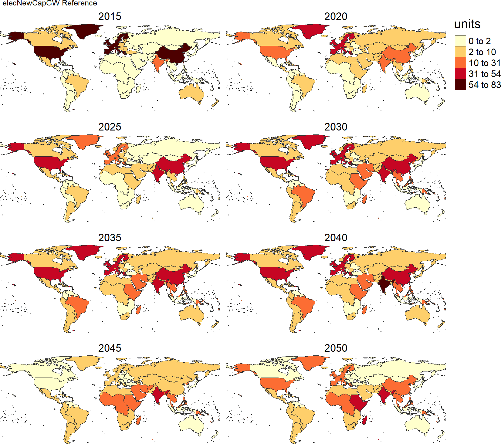

<!-------------------------->
<!-------------------------->
# Structure
<!-------------------------->
<!-------------------------->

<p align="center"> </p>

`plutus::gcamInvest` integrates the functionality of reading CGAM database and calculating stranded assets and electricity investments in the power sector. This function will return a list containing:

- data: a dataframe with the post-processed GCAM output showing stranded assets and electricity investment (see [Table 1](#table1)) by scenario, region, technology, and time period 
- dataAggParam: a dataframe with the data aggregated to the parameter
- dataAggClass1: a dataframe with the data aggregated to class 1
- dataAggclass2: a dataframe with the data aggregated to class 2
- scenarios: A list of the scenarios
- queries: A list of the queries used to extract the data

<br />

<a name="table1"></a>
**Table 1:** Descriptions of output parameters for stranded assets and electricity investments.

| Parameter | Description | Unit |
|---|---|---|
| elecNewCapCost | 5-year electricity capacity installations | Billion 2015 USD |
| elecNewCapGW | 5-year electricity capacity installations | Gigawatts |
| elecAnnualRetPrematureCost | 5-year premature retirements | Billion 2015 USD |
| elecAnnualRetPrematureGW | 5-year premature retirements | Gigawatts |
| elecCumCapCost | Cumulative electricity capacity installations | Billion 2015 USD |
| elecCumCapGW | Cumulative electricity capacity installations | Gigawatts |
| elecCumRetPrematureCost | Cumulative premature retirements | Billion 2015 USD |
| elecCumRetPrematureGW | Cumulative premature retirements | Gigawatts |

**Note: the new electricity investment and stranded assets in the base year (2015) are set to 0.


The details of arguments and their default values in `plutus::gcamInvest` can be found in the [gcamInvest reference page](https://jgcri.github.io/plutus/reference/gcamInvest.html). The following sections provide step-by-step instructions on using `plutus::gcamInvest`.

```{r eval=F}
# Default argument values
plutus::gcamInvest(gcamdatabase = NULL,
                   queryFile = NULL,
                   reReadData = T,
                   dataProjFile = paste(getwd(), "/outputs/dataProj.proj", sep = ""),
                   gcamdataFile = NULL,
                   scenOrigNames = 'All',
                   scenNewNames = NULL,
                   regionsSelect = NULL,
                   dirOutputs = paste(getwd(), "/outputs", sep = ""),
                   folderName = NULL,
                   nameAppend = "",
                   saveData = T)
```

<br />

<!-------------------------->
<!-------------------------->
# Read GCAM Data
<!-------------------------->
<!-------------------------->
<p align="center"> </p>

## Read .proj File

`plutus::gcamInvest` is able to read rgcam-based .proj file from GCAM output by providing the path to the .proj file. `plutus` also includes an example .proj dataset `plutus::exampleGCAMproj`.

```{r eval=F}
library(plutus)

invest <- plutus::gcamInvest(# dataProjFile = path_to_projfile,
                             dataProjFile = plutus::exampleGCAMproj)

# Explore the list returned from plutus::gcamInvest
df <- invest$data; df
dfParam <- invest$dataAggParam; dfParam
dfClass1 <- invest$dataAggClass1; dfClass1
dfScenario <- invest$scenarios; dfScenario
dfQuery <- invest$queries; dfQuery

```

<br />

## Read GCAM XML Database

`plutus::gcamInvest` can directly read GCAM output XML database. Assign the path of GCAM database to `gcamdatabase` argument.


```{r eval=F}
library(plutus)

# provide path to the desired GCAM database folder.
path_to_gcamdatabase <- 'E:/gcam-core-gcam-v5.3/output/databse_basexdb'
invest <- plutus::gcamInvest(gcamdatabase = path_to_gcamdatabase)

```

<br />

<!-------------------------->
<!-------------------------->
## Subset GCAM Data
<!-------------------------->
<!-------------------------->

`plutus::gcamInvest` provides options to subset GCAM data by scenario and region.


```{r eval=F}
library(plutus)

invest <- plutus::gcamInvest(dataProjFile = plutus::exampleGCAMproj,
                             scenOrigNames = c('Reference', 'Impacts', 'Policy'),
                             scenNewNames = c('Reference', 'Climate Impacts', 'Climate Policy'),
                             regionsSelect = c('USA', 'Argentina'))

df <- invest$data; df
dfParam <- invest$dataAggParam; dfParam
dfClass1 <- invest$dataAggClass1; dfClass1

```

<br />

<!-------------------------->
<!-------------------------->
# Input Data and Assumptions
<!-------------------------->
<!-------------------------->
<p align="center"> </p>

`plutus` provides default data and assumptions files from GCAM v5.3 that are collected from Default-GCAM-5.3-Folder/input/gcamdata/. All data files (CSV) associated with different data categories and assumptions are listed in [Table 2](#table2).

<a name="table2"></a>
**Table 2:** Data and assumption files.

| Data or Assumption | Technology | Region | Data File |
|---|---|---|---|
| Overnight capital costs | Electricity generation technologies | Global | L2233.GlobalIntTechCapital_elec.csv <br /> L2233.GlobalTechCapital_elecPassthru.csv |
| Overnight capital costs | Cooling technologies | Global | L2233.GlobalIntTechCapital_elec_cool.csv <br /> L2233.GlobalTechCapital_elec_cool.csv |
| Capacity factors | Electricity generation technologies | Global | L223.GlobalTechCapFac_elec.csv |
| Capacity factors | Intermittant technologies | Global | L223.GlobalIntTechCapFac_elec.csv |
| Capacity factors | Intermittant technologies | Regional | L223.StubTechCapFactor_elec.csv |
| Lifetime and steepness| Electricity generation technologies | Global | A23.globaltech_retirement.csv |

However, users may run GCAM v5.3 with updated/customized values associated with capital costs, capacity factors, and lifetime by technology and region. In this case,  `plutus::gcamInvest` allows users to input their own data associated with their GCAM runs. All you need to do is to provide the path that includes **ALL** CSV files listed in [Table 2](#table2). Here are two options:

- Users can update CSV files listed in [Table 2](#table2) directly in Your-GCAM-5.3-Folder/input/gcamdata. Then, specify argument to `gcamdataFile = Your-GCAM-5.3-Folder/input/gcamdata`.
- Users can copy and paste all CSV files listed in  [Table 2](#table2) from Your-GCAM-5.3-Folder/input/gcamdata to a new folder and update the values according to your GCAM run. Then, specify argument to `gcamdataFile = Path-to-Your-New-Folder`.

While updating the values in those CSV files, please keep the file name and the format of each updated file unchanged.

```{r eval=F}
library(plutus)

invest <- plutus::gcamInvest(dataProjFile = plutus::exampleGCAMproj,
                             gcamdataFile = 'E:/gcam-core-gcam-v5.3/input/gcamdata')
```

<br />

<!-------------------------->
<!-------------------------->
# Output Options
<!-------------------------->
<!-------------------------->
<p align="center"> </p>

`plutus::gcamInvest` automatically saves outputs, such as .proj files, queries, and output data tables in default path based on the working directory. This section will introduce arguments in `plutus::gcamInvest` that control different output options.

## Re-read Data

`plutus::gcamInvest` automatically save a copy of .proj file (default name: dataProj.proj) in the output directory after extracting GCAM output data if provided a GCAM database folder using `gcamdatabase` argument. Reload the same (subsetted) GCAM dataset can be much faster by using the automatically saved dataProj.proj file. Users can choose to turnoff auto save function by specifying argument to `reReadData = F`.

```{r eval=F}
library(plutus)

path_to_gcamdatabase <- 'E:/gcam-core-gcam-v5.3/output/databse_basexdb'
invest <- plutus::gcamInvest(gcamdatabase = path_to_gcamdatabase,
                             reReadData = F) # Default is reReadData = T
```

<br />

## Output Directory

It is easy to change output folder names and names appended to the output data tables.

  - `folderName` creates a folder with the specified name under output directory 
  - `nameAppend` appends the specified string at the end of each output data table file 

```{r eval=F}
library(plutus)

invest <- plutus::gcamInvest(dataProjFile = plutus::exampleGCAMproj,
                             # dirOutputs = Your-desired-output-path, # Default is paste(getwd(), "/outputs", sep = "")
                             folderName = 'USA', # Default is fodlerName = NULL
                             nameAppend = '_Invest') # Default is nameAppend = ''
```

You can also choose not to save any output by setting argument to `saveData = F`.
```{r eval=F}
library(plutus)

invest <- plutus::gcamInvest(dataProjFile = plutus::exampleGCAMproj,
                             saveData = F) # Default is saveData = T
```

<br />

<!-------------------------->
<!-------------------------->
# Visualization
<!-------------------------->
<!-------------------------->
<p align="center"> </p>

`plutus` is designed to integrate with `metis` (Khan et al., 2020), an R package to harmonize and analyze multi-sectoral data and linkages at variable spatial scales. `plutus::gcamInvest` generates a data structure that can be directly used by `metis`. More details on metis can be accessed via metis repository at https://github.com/JGCRI/metis.

## Charts

Below is an example of using `metis.chartsProcess` to generate charts of stranded assets and electricity investments in the USA and Argentina.

```{r eval=F}
library(plutus)
library(metis)

invest <- plutus::gcamInvest(dataProjFile = plutus::exampleGCAMproj,
                             scenOrigNames = c('Reference', 'Impacts', 'Policy'),
                             scenNewNames = c('Reference', 'Climate Impacts', 'Climate Policy'),
                             regionsSelect = c('USA', 'Argentina'))
rTable_i <- invest$data

# Plot charts for each scenario and comparison between scenarios and regions across time series
metis.chartsProcess(rTable = rTable_i,
                    paramsSelect = 'All',
                    regionsSelect = c('USA', 'Argentina'),
                    xCompare = c("2030", "2040", "2050"),
                    scenRef = "Reference",
                    dirOutputs = paste(getwd(), "/outputs", sep = ""),
                    regionCompare = 1,
                    scenarioCompareOnly = 1,
                    multiPlotOn = T,
                    multiPlotFigsOnly = T,
                    folderName = "Charts_USA_Argentina",
                    xRange = c(2025, 2030, 2035, 2040, 2045, 2050),
                    colOrderName1 = "scenario",
                    pdfpng = 'pdf')
```

<p align="center" style="font-size:18px;"> *New Electricity Capacity Installations for USA and Argentina* </p>
<p align="center"> </p>

<br />

## Maps

Users can also use `metis.mapsProcess` to produce spatial maps by scenario, region, technology, and time period. Here is an example to map wind capacity installations for 32 geopolitical regions.

```{r eval=F}
library(plutus)
library(metis)

invest <- plutus::gcamInvest(dataProjFile = plutus::exampleGCAMproj,
                             scenOrigNames = 'Reference',
                             regionsSelect = NULL,
                             saveData = F)

rTable_i <- invest$data
# Filter data to only show new installations for wind
polygonTable_i <- rTable_i %>% 
  dplyr::filter(class1 %in% 'Wind', param %in% 'elecNewCapGW') %>% 
  dplyr::select(subRegion, value, x, class1, scenario, param) %>% 
  dplyr::rename(class = class1)

# Plot wind new installation maps for all 32 geopolitical regions across time
metis.mapsProcess(polygonTable = polygonTable_i,
                  subRegCol = 'subRegion',
                  subRegType = 'subRegion',
                  folderName = 'Maps_Wind_eleNewCapGW',
                  facetCols = 2,
                  animateOn = F)
```

<p align="center" style="font-size:18px;"> *Regional Electricity Capacity Installations for Wind Technology* </p>
<p align="center"> </p>
